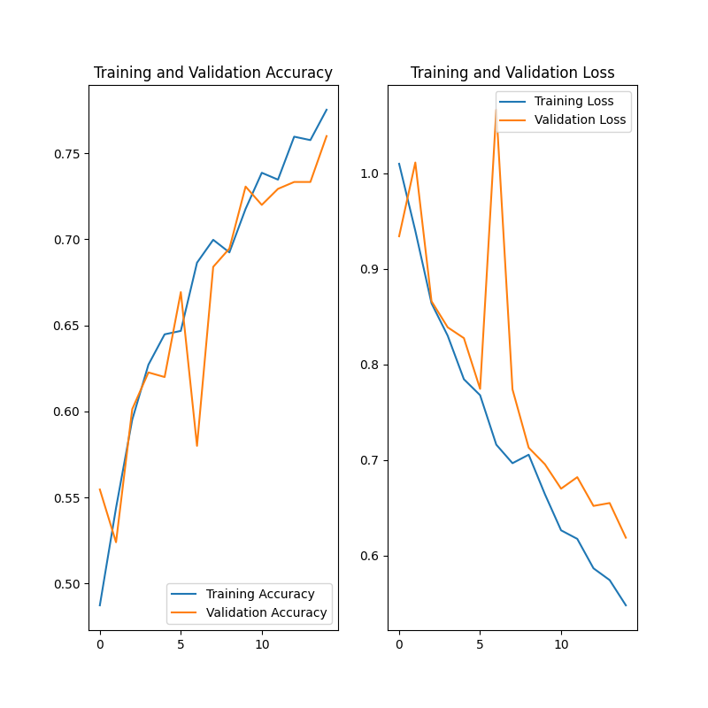

# Getting started with myHealth!

## Requirements to run myHealth!
**Poetry must be installed to run myHealth!**
* [Instructions on installing poetry](https://python-poetry.org/docs/#installation)

## To run this project
1. Install poetry. [Link to instructions.](https://python-poetry.org/docs/#installation)
2. Intialize virtual environment.
```
poetry shell
```
3. Install dependencies.
```
poetry install
```
4. Run
```
python myhealth/myHealth.py path/to/image.jpeg
```
* *If you don't have an image and want to try out a demo, you may run the following command*:
```
python myhealth/myHealth.py path/to/image.jpeg
```

### If you really want to use a makefile.
* You will still need to install poetry.
* After you install poetry, you may install the dependencies with the following cmd: `make install`
* Run a demo with the following cmd: `make run_demo`

---

## Project Structure:
### data
* The `data` directory contains 2 NoSQL databases containing nutritional data.
* One contains a great deal of nutritional information on a few foods.
* The other is a database that contains only a little nutritional data on around 4,800 foods.
* These databases are TinyDB databases.
    * Link for more information on [TinyDB](https://tinydb.readthedocs.io/en/latest/)
### model
* The `model` directory contains:
    * Small CNN model used to classify images of food.
    * Images of the performance of the model.
    * A few images of foods to use for demos.
### myhealth
* The `myhealth` directory contains the source code.
### tests
* The `tests` directory contains unit tests.
### poetry.lock
* This is a file containing the dependencies and their versions that are capatible and stable.
### pyproject.toml
* This file contains the metadata for myHealth.


## Using Poetry

### Install dependencies
```
poetry install
```

### Add dependencies
```
poetry add [package-name]
```

### Activate Poetry Virtual Environment
```
poetry shell
```

### Exit Poetry's Virtual Environment
```
exit
```

### Run cmds
```
poetry run [cmd]
```
* Like black or pytest.

# To build this project
```
poetry build
```

# To publish this project
```
poetry publish
```

---

# Typer
*Typer* is the tool we will use to create the CLI (command line interface).

* [Getting started with Typer](https://typer.tiangolo.com/)
    * [A more in depth introduction](https://typer.tiangolo.com/tutorial/)
* [Hints and docstrings](https://typer.tiangolo.com/tutorial/arguments/help/)
* [Testing Typer apps](https://typer.tiangolo.com/tutorial/testing/)
* [Packaging Typer to publish](https://typer.tiangolo.com/tutorial/package/)

---

# Model

# Mini Model
* Used for development and demo purposes.
* Followed [this tutorial](https://www.tensorflow.org/tutorials/images/classification) (among a few others)
    * Used [this tutorial](https://www.tensorflow.org/guide/keras/serialization_and_saving) in particular to save and load the model.
## Performance


---

# Data Sources
* [AI Crowd Food Recognition 2022](https://www.aicrowd.com/challenges/food-recognition-benchmark-2022/dataset_files)
* [Food 101](https://www.kaggle.com/datasets/dansbecker/food-101?resource=download)
* [UEC FOOD 256](http://foodcam.mobi/dataset256.html)
